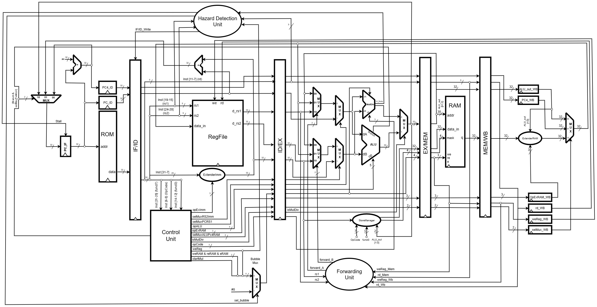

# RV32IM Processor — 5-Stage Pipeline in VHDL



**Team:**
| Name | Role |
|------|------|
| Henrique Rocha Bomfim | Pipeline — design & implementation |
| Pedro Carvalho Ribeiro Neto | Pipeline — design & implementation |
| Luiz Felipe Borelli Durand | Multdiv, KPIs & Tests |
| Luka Siqueira Ferreira de Figueiredo | Tests, KPIs & multdiv |

**Advisor:** [Rafael Corsi](https://github.com/rafaelcorsi)

---

## Overview

This repository implements, in **VHDL**, a **RV32IM** processor (32-bit RISC-V base integer + M extension) organized as a **5-stage in-order pipeline** running at a single clock edge.

The project evolved from a prior RV32I **multi-cycle** core (3 clock cycles per instruction) into a fully pipelined design capable of issuing one instruction per cycle under normal conditions. The pipeline handles all classic hazard classes and integrates a combinational multiply/divide unit in parallel with the ALU.

### What was implemented

| Feature | Module |
|---------|--------|
| 5-stage pipeline (IF → ID → EX → MEM → WB) | `rv32im_pipeline_core.vhd` |
| Pipeline registers with `valid`, `flush` and `stall` | `reg_IF_ID`, `reg_ID_EX`, `reg_EX_MEM`, `reg_MEM_WB` |
| RAW forwarding (EX/MEM → EX, MEM/WB → EX) | `forwarding_unit.vhd` |
| Load-use hazard stall + opcode-aware detection | `hazard_detection_unit.vhd` + `bubble_mux.vhd` |
| Control hazard flush (branch, JAL, JALR) | `reg_IF_ID` + `reg_ID_EX` flush paths |
| Structural hazard elimination | Harvard architecture (separate ROM / RAM) |
| RV32M: MUL, MULH, MULHSU, MULHU, DIV, DIVU, REM, REMU | `multdiv.vhd` (Booth multiplier + non-restoring divider, stall via `muldiv_busy`) |
| Automated unit + integration tests | Cocotb + GHDL |
| FPGA synthesis | Quartus (Cyclone V — DE0-CV) |

---

## Architecture

### Pipeline stages

```
┌──────┐  reg_IF_ID  ┌──────┐  reg_ID_EX  ┌──────┐  reg_EX_MEM  ┌──────┐  reg_MEM_WB  ┌──────┐
│  IF  │ ──────────► │  ID  │ ──────────► │  EX  │ ───────────► │ MEM  │ ────────────► │  WB  │
└──────┘             └──────┘             └──────┘              └──────┘               └──────┘
   ▲                    │                    ▲  ▲                                          │
   │                    ▼                    │  │                                          │
   │              ┌──────────┐    ┌──────────────────┐                                    │
   │              │   HDU    │    │  Forwarding Unit  │                                    │
   │              │ (stall)  │    │  EX/MEM → EX      │                                    │
   │              └──────────┘    │  MEM/WB → EX      │                                    │
   │                              └──────────────────┘                                    │
   └──────────────────────────── wb_data (RegFile write-back) ◄──────────────────────────┘
```

### Hazard handling

#### RAW forwarding — `forwarding_unit.vhd`
Detects read-after-write dependencies between in-flight instructions and drives 3:1 muxes at the EX stage inputs. Priority: EX/MEM > MEM/WB. The forwarding source for MEM/WB is `wb_data` (the final WB mux output — ALU result, PC+4, or extended RAM data), so loads that complete in MEM are also forwarded correctly. The `valid` bit of each pipeline register is ANDed into the forwarding condition to prevent spurious forwarding from bubbles.

Encoding of `forward_A` / `forward_B`:
| Code | Source |
|------|--------|
| `"00"` | ID/EX — value read from RegFile in ID |
| `"10"` | EX/MEM — `exmem_alu_out` |
| `"01"` | MEM/WB — `wb_data` |

#### Load-use stall — `hazard_detection_unit.vhd` + `bubble_mux.vhd`
When a load is in EX (`idex_reRAM = '1'`) and the instruction in ID uses the load's destination register, a 1-cycle stall is inserted:
- PC and IF/ID are frozen (`if_pc_write_en`, `ifid_write_en` → `'0'`)
- A NOP bubble is injected into ID/EX (`id_bubble_sel` → `'1'`)

The HDU decodes the opcode of the instruction in ID to determine which source registers are actually read, preventing false stalls on I-type and load instructions whose `rs2` field encodes part of the immediate.

The `bubble_mux` zeroes only the five signals with side effects — `weReg`, `weRAM`, `reRAM`, `eRAM`, `startMul` — leaving the rest of the ID/EX packet intact.

#### Control hazard flush
Branch outcome and jump targets are resolved in EX. The strategy is **assume-not-taken**: if a branch or jump is confirmed taken, the two instructions already fetched are invalidated by flushing both IF/ID and ID/EX (`flush_if_id`, `flush_id_ex`).

| Instruction | Condition | Target |
|-------------|-----------|--------|
| Branch (`1100011`) | `ex_valid AND alu_branch_flag` | `PC + imm` |
| JAL (`1101111`) | `ex_valid` | `PC + imm` |
| JALR (`1100111`) | `ex_valid` | `(rs1 + imm) AND 0xFFFFFFFE` |

JALR takes priority over branch in the PC source mux.

#### Structural hazard
Avoided by the **Harvard architecture**: instructions are fetched from ROM and data is accessed via a separate RAM, so there is no port conflict between stages.

### RV32M — multiply and divide

The `multdiv.vhd` module implements all eight M-extension operations (MUL, MULH, MULHSU, MULHU, DIV, DIVU, REM, REMU) using a sequential Booth multiplier and a non-restoring divider. While an operation is in progress, `muldiv_busy` freezes the ID/EX, EX/MEM and MEM/WB registers via `muldiv_stall_n` until the result is ready. An extra stall cycle is inserted when `done` pulses, ensuring `saida_capt` has stabilised before the EX/MEM register captures it. The `isMulDiv` control signal selects the MulDiv result instead of the ALU result. Forwarding for M-extension results follows the same path as any other R-type instruction.

---

## Repository Structure

```
.
├── src/                   # All VHDL source modules
│   ├── rv32im_pipeline_core.vhd       # Top-level pipeline core
│   ├── rv32im_pipeline_types.vhd      # Shared type definitions
│   ├── rv32i_ctrl_consts.vhd          # Control constants
│   ├── pc_fetch.vhd                   # IF stage
│   ├── reg_IF_ID.vhd                  # IF/ID pipeline register
│   ├── control_unit.vhd               # ID: instruction decoder + control
│   ├── RegFile.vhd                    # Register file (32×32-bit)
│   ├── ExtenderImm.vhd                # Immediate sign-extension
│   ├── bubble_mux.vhd                 # NOP injection for load-use stall
│   ├── hazard_detection_unit.vhd      # Load-use & muldiv stall detection
│   ├── reg_ID_EX.vhd                  # ID/EX pipeline register
│   ├── ALU.vhd                        # Arithmetic/logic unit
│   ├── RV32M.vhd                      # M-extension: mul/div (combinational)
│   ├── forwarding_unit.vhd            # RAW forwarding logic
│   ├── StoreManager.vhd               # Byte-enable mask for stores
│   ├── reg_EX_MEM.vhd                 # EX/MEM pipeline register
│   ├── ExtenderRAM.vhd                # Load sign/zero extension (WB)
│   └── reg_MEM_WB.vhd                 # MEM/WB pipeline register
│
├── docs/
│   ├── img/                           # Architecture diagrams
│   ├── PIPELINE_ARCHITECTURE_GUIDE.md # Detailed architecture reference
│   └── RV32IM_PIPELINE_PASSO0_CONTRATO.md  # Signal contract between stages
│
└── tests/
    ├── FPGA/                          # Quartus projects for module-level FPGA testing
    └── python/                        # Cocotb testbenches (GHDL simulation)
        ├── unittests/
        │   ├── entities/              # Unit tests: ALU, RegFile, HDU, FWU, BubbleMux, …
        │   └── instructions/          # Integration tests: one–six (RV32I), mul (RV32M)
        ├── runner.py                  # Orchestrates compilation and simulation
        └── tests.json                 # Test catalog (toplevel + source list per test)
```

### Key source files

| File | Purpose |
|------|---------|
| `rv32im_pipeline_core.vhd` | Instantiates all stages; wires hazard, forwarding, branch and WB signals |
| `hazard_detection_unit.vhd` | Detects load-use hazard; drives PC/IF-ID freeze and bubble injection |
| `forwarding_unit.vhd` | Detects RAW hazards; drives `forward_A`/`forward_B` mux selectors |
| `bubble_mux.vhd` | Zeroes side-effect control signals when a NOP bubble is needed |
| `RV32M.vhd` | Combinational multiply/divide; result selected in EX by `isMulDiv` |
| `control_unit.vhd` | Decodes opcode and generates all datapath control signals |

---

## Verification

Tests are written in Python using **Cocotb** and simulated with **GHDL**.

### Unit tests (isolated modules)

| Test | Module under test |
|------|-------------------|
| `ALU` | `ALU.vhd` |
| `bancoRegistradores` | `RegFile.vhd` |
| `ControlUnit` | `control_unit.vhd` |
| `HazardDetectionUnit` | `hazard_detection_unit.vhd` |
| `ForwardingUnit` | `forwarding_unit.vhd` |
| `BubbleMux` | `bubble_mux.vhd` |
| `ExtenderRAM` | `ExtenderRAM.vhd` |
| `ExtenderImm` | `ExtenderImm.vhd` |
| `StoreManager` | `StoreManager.vhd` |
| `RAM`, `ROM` | Memory models |

### Integration tests (full pipeline)

Tests `one` through `six` run RISC-V assembly programs through the complete pipeline (`rv32im_pipeline_core`) and verify register and memory state. Test `MUL` exercises the M-extension instructions.

### Running tests

```bash
# Run all tests
make test

# Run a specific test
make test TEST=ForwardingUnit
make test TEST=MUL
```

Waveforms (`.ghw`) can be opened with **GTKWave**:

```bash
gtkwave tests/python/sim_build/<toplevel>/waves.ghw
```

---

## FPGA

The design targets the **Cyclone V (5CEBA4F23C7)** on the **DE0-CV** board. Open the Quartus project, compile, and program:

```
src/rv32im_pipeline_fpga.qpf   ← Quartus project
```

The FPGA top-level wrapper instantiates `rv32im_pipeline_core` alongside the ROM and RAM Quartus IPs and connects the clock, reset, and debug LEDs.

---

## Development Environment (Dev Container)

This project ships with a ready-to-use VS Code **Dev Container** so you don't have to install Cocotb, GHDL, or Python manually.

### Prerequisites
1. [Docker](https://docs.docker.com/get-docker/) (Desktop on Mac/Windows, Engine on Linux)
2. [Visual Studio Code](https://code.visualstudio.com/)
3. VS Code extension: **Dev Containers** (`ms-vscode-remote.remote-containers`)

### First-time setup
1. Open the folder in VS Code.
2. VS Code will detect `.devcontainer/devcontainer.json` and prompt:

   **"Reopen in Container?"** → click **Yes**.

### Usage inside the container

```bash
# Run all tests
make test

# Open a waveform
gtkwave <file>.ghw
```
